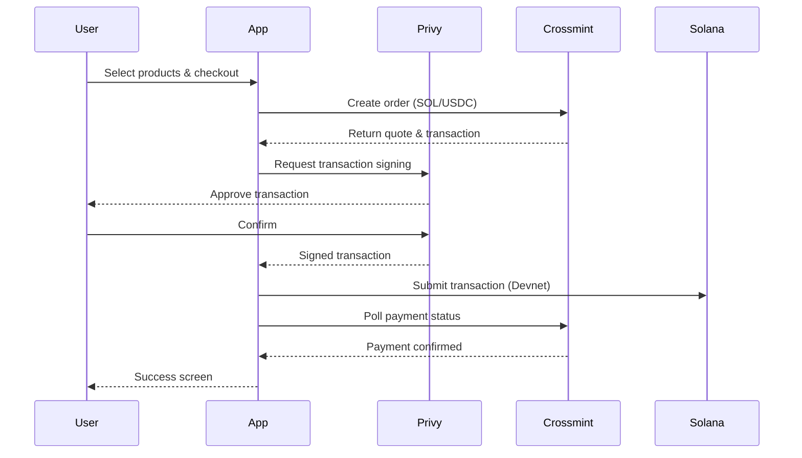

<p align="center">
  
  &nbsp;&nbsp;&nbsp;
  
  &nbsp;&nbsp;&nbsp;
  
  &nbsp;&nbsp;&nbsp;
  
</p>

<h1 align="center">Expo Solana Crypto Checkout</h1>

<p align="center">
  A React Native mobile app for purchasing real-world products with <strong>SOL</strong> and <strong>USDC</strong> on Solana — powered by Privy wallet auth and Crossmint payments.
</p>

<p align="center">
  
  
  
  
  
  
</p>

---

## Features

- **Wallet Authentication** — Sign in with Solana wallet via Privy (email, social, or passkey)
- **Product Browsing** — Browse Amazon products with real images and descriptions
- **Cart Management** — Add, remove, and update quantities with Zustand state management
- **Crypto Payments** — Pay with SOL or USDC on Solana Devnet via Crossmint
- **Transaction Signing** — Sign Solana transactions directly from your mobile wallet
- **Order Tracking** — Real-time payment status polling with success/failure feedback
- **Shipping Address** — Full address form with validation (US addresses)
- **Secure Storage** — Sensitive data stored with Expo Secure Store

## Tech Stack

| Layer | Technology |
|-------|-----------|
| Framework | [Expo SDK 53](https://expo.dev/) + [React Native](https://reactnative.dev/) |
| Language | [TypeScript](https://www.typescriptlang.org/) (strict mode) |
| Auth | [Privy](https://www.privy.io/) — Web3 wallet authentication |
| Payments | [Crossmint](https://www.crossmint.com/) — Crypto checkout infrastructure |
| Blockchain | [Solana](https://solana.com/) via `@solana/web3.js` |
| Navigation | [Expo Router](https://docs.expo.dev/router/introduction/) |
| State | [Zustand](https://zustand-demo.pmnd.rs/) (local) + [TanStack Query](https://tanstack.com/query) (server) |
| UI | [React Native Paper](https://reactnativepaper.com/) |

## Architecture

```
src/
├── app/                # Expo Router screens & navigation
│   ├── (tabs)/         # Tab navigation (products, profile)
│   ├── auth.tsx        # Authentication screen
│   ├── cart.tsx        # Shopping cart
│   ├── checkout.tsx    # Shipping & payment selection
│   ├── payment.tsx     # Transaction signing & processing
│   └── payment-success.tsx
├── hooks/              # Custom React hooks
│   ├── useAuth.ts      # Authentication state
│   ├── useCart.ts      # Cart operations
│   └── useWalletBalance.ts
├── screens/            # Screen components
├── services/           # API integrations
│   ├── crossmint.ts    # Crossmint order & payment API
│   └── privy.tsx       # Privy SDK configuration
├── store/              # Zustand stores
│   ├── cartStore.ts    # Cart state management
│   └── userStore.ts    # User preferences
├── types/              # TypeScript type definitions
└── utils/              # Constants, helpers, wallet utils
```

## Payment Flow



## Getting Started

### Prerequisites

- [Node.js](https://nodejs.org/) 18+
- [Expo CLI](https://docs.expo.dev/get-started/installation/)
- [Privy](https://www.privy.io/) account & App ID
- [Crossmint](https://www.crossmint.com/) account & API keys (testnet)

### Installation

```bash
# Clone the repository
git clone https://github.com/helioxco/expo-solana-crypto-checkout.git
cd expo-solana-crypto-checkout

# Install dependencies
npm install
```

### Environment Setup

```bash
cp .env.example .env
```

Add your API keys to `.env`:

```env
EXPO_PUBLIC_PRIVY_APP_ID=your_privy_app_id
CROSSMINT_CLIENT_SECRET=your_crossmint_testnet_secret
EXPO_PUBLIC_CROSSMINT_PROJECT_ID=your_crossmint_project_id
EXPO_PUBLIC_USE_TESTNET=true
EXPO_PUBLIC_SOLANA_RPC_URL=https://api.devnet.solana.com
```

### Run

```bash
npx expo start
```

Scan the QR code with Expo Go (iOS/Android) or press `i` / `a` to open in a simulator.

## Testnet Tokens

This app runs on **Solana Devnet** only — no real funds are used.

| Token | Amount | Source |
|-------|--------|--------|
| SOL | 5.0 | [Solana Faucet](https://faucet.solana.com/) |
| USDC | 100.0 | Mocked for devnet |

## Supported Payment Methods

| Currency | Network | Exchange Rate (Mock) |
|----------|---------|---------------------|
| SOL | Solana Devnet | 1 SOL = $20 |
| USDC | Solana Devnet | 1 USDC = $1 |

## Resources

- [Privy Docs — React Native](https://docs.privy.io/guide/react-native/)
- [Crossmint Docs — Headless Checkout](https://docs.crossmint.com/payments/headless/)
- [Solana Web3.js Docs](https://solana-labs.github.io/solana-web3.js/)
- [Solana Devnet Explorer](https://explorer.solana.com/?cluster=devnet)

## License

MIT
